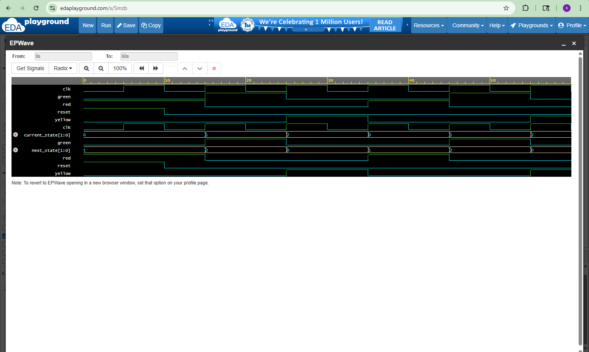

# FSM Traffic Light Controller

## Overview
This project implements and verifies a traffic light controller using a Finite State Machine (FSM) in SystemVerilog.

## Features
- RED state
- GREEN state
- YELLOW state
- Clock-driven state transitions
- Reset handling
- State-based output control

## Design (RTL)
The traffic light controller is implemented as a sequential FSM. The design uses a current state register, next-state logic, and output logic to control the red, yellow, and green lights.

## FSM State Flow
RED → GREEN → YELLOW → RED

## Verification
A SystemVerilog testbench is used to:
- Apply reset
- Generate clock
- Verify state transitions
- Validate output signals
- Generate waveform output

## Tools Used
- SystemVerilog
- EDA Playground
- Icarus Verilog
- EPWave

## Waveform

## Simulation Output

## Simulation Output

State transitions observed:
- RED → GREEN
- GREEN → YELLOW
- YELLOW → RED

Traffic light sequence verified successfully.
